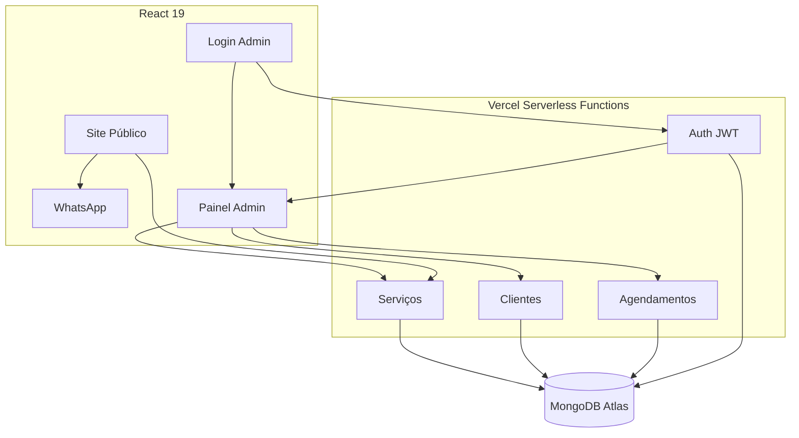

<div align="center">

# 🏥 Clínica Fabi Contiero

<p>
  
  
  
  
  
  
</p>

**Plataforma full-stack serverless para gestão de agendamentos de clínica de estética.**

[🌐 Acesse o Site](https://fabicontiero.vercel.app/)

</div>

---
<div align="center">
  Desenvolvido por <strong>Gabriel Perencine Lima</strong>
</div>

## Sobre

Sistema desenvolvido para digitalizar o fluxo de agendamentos da **Clínica Fabi Contiero**, substituindo processos manuais por uma plataforma moderna com duas frentes integradas:

- **Site Público** — Landing page, catálogo de serviços e agendamento via WhatsApp, monitorada por Vercel Speed Insights e Analytics.
- **Painel Administrativo** — Gestão de agendamentos, fichas de clientes, histórico de consultas e métricas gerenciais, protegido por autenticação JWT.

---

## Funcionalidades

| Feature | Descrição |
|---|---|
| 📅 Agendamento via WhatsApp | Formulário público integrado diretamente ao WhatsApp da clínica |
| 🔒 Painel Admin com JWT | Acesso protegido e senhas via bcrypt |
| 👥 Gestão de Clientes | Fichas, histórico de consultas e métricas gerenciais |
| 📊 Analytics em Tempo Real | Monitoramento de Web Vitals via Vercel Speed Insights |
| 🛡️ Segurança | CORS restrito, Helmet, SSL MongoDB, headers protegidos via `vercel.json` |

---

## Stack

| Camada | Tecnologia |
|---|---|
| **Backend** | Node.js 18+, Express 5, Mongoose, JWT, bcryptjs, Helmet |
| **Frontend** | React 19, React Router 7, Axios, Framer Motion, Chart.js |
| **Banco de Dados** | MongoDB Atlas (replica sets, SSL) |
| **Deploy** | Vercel — API como Serverless Functions, frontend estático |
| **Testes** | Jest, Supertest, mongodb-memory-server |
| **Qualidade** | SonarQube Cloud, GitHub Actions (CI/CD) |

---

## Arquitetura

O projeto é dividido em dois diretórios independentes que convergem na mesma plataforma de infraestrutura (Vercel):

```
clinica-estetica/
├── backend/     # API RESTful — Vercel Serverless Functions (/api/*)
└── frontend/    # SPA React otimizada
```



---

## Configuração Local

**Pré-requisito:** Node.js 18+, cluster MongoDB Atlas (gratuito).

```bash
git clone https://github.com/GPerencine/clinica-fabicontiero.git

# Backend
cd backend && npm install && cp .env.example .env
npm run dev        # http://localhost:3001

# Frontend (novo terminal)
cd ../frontend && npm install
npm start          # http://localhost:3000

# Seed do primeiro admin
cd backend && node seedAdmin.js
```

**`backend/.env`**
```env
PORT=3001
MONGODB_URI=mongodb+srv://<user>:<password>@cluster.mongodb.net/clinica
SECRET_KEY=chave_jwt_forte
FRONTEND_URL=http://localhost:3000
NODE_ENV=development
```

**`frontend/.env`**
```env
REACT_APP_API_URL=http://localhost:3001/api
REACT_APP_GOOGLE_MAPS_API_KEY=sua-chave-maps
```

```bash
cd backend && npm test   # Testes de integração com banco em memória
```

---

## Licença

Desenvolvido sob contrato para uso privado da Clínica Fabi Contiero. Disponibilizado para fins de portfólio.